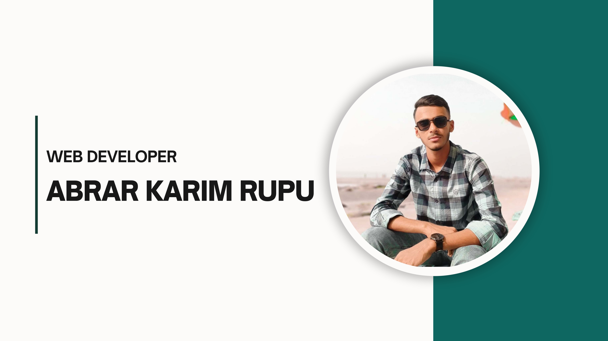

<!-- Banner Image -->

  

<!-- Name & Designation -->
<h1 align="center">Hi, I'm ABRAR KARIM RUPU 👋</h1>
<h3 align="center">MERN stack Web Developer</h3>

<!-- Location and Email -->

  📍 Dhaka, Bangladesh &nbsp; | &nbsp;
  📧 <a href="abrarkarimrupu1075@gmail.com">abrarkarimrupu1075@gmail.com</a> &nbsp; | &nbsp;
  📞 +8801903192439

---

### 👨‍💻 About Me

- 🚀 I’m passionate about building web applications.
- 🎯 Currently focusing on mastering full-stack development.
- 🧠 I love solving real-world problems using code.
- 🌱 Always learning new technologies and frameworks.

---

### 🔭 Current Activities

- 🚀 Exploring Next.js
- 🌐 Building a tourism website
- 📘 Learning advanced JavaScript and TypeScript

---

### 💡 Skills

#### 🖥 Frontend

  

#### 🗄 Backend

  

#### 🛠 Tools & Others

  

---

### 🔗 Social Links

  
  
  

---

### 📊 GitHub Stats

<!-- GitHub Stats Cards -->

  

  

  

---
